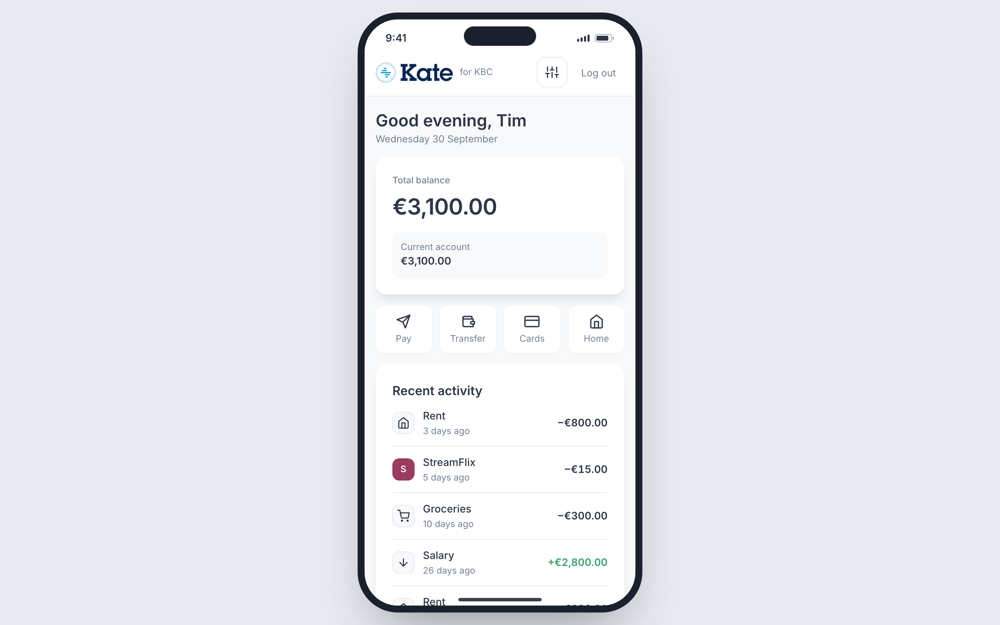
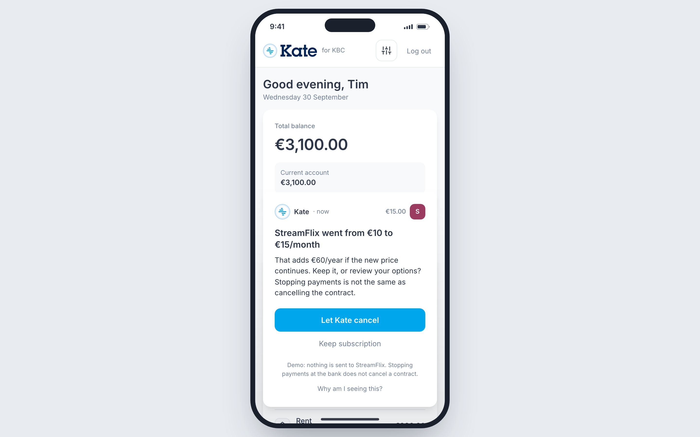
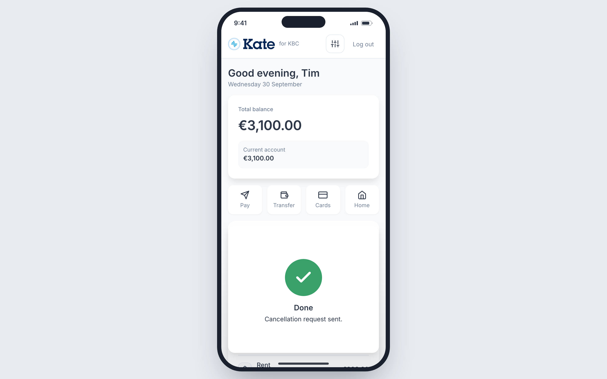

# Kate for KBC

**A proactive financial assistant that spots money-saving opportunities in a customer's transactions, prepares the solution, and brings one simple decision.**

Team Fonske · Tectonic Hackathon 2026 · KBC challenge

| | | |
|---|---|---|
|  |  |  |

## The idea

Everyday finances involve dozens of small tasks: remembering trial deadlines, noticing price increases, comparing bills and deciding how much to save. When these tasks are tedious, people postpone them—and opportunities to save money disappear.

Our concept makes Kate a proactive financial assistant that spots these opportunities, prepares the solution and brings the customer a simple decision.

**Subscription management (SEPA Compliant):** Kate identifies repeated payments to the same merchant and automatically builds a subscription list. It compares charges over time, flags price increases and estimates upcoming renewals. To protect customers from breach-of-contract penalties, Kate intercepts initial tokenization pings for free trials to set reminders, and uses KBC's native SEPA mandate manager to execute legally compliant freezes rather than arbitrary payment blocking.

**Savings and investments (MiFID II Compliant):** Kate analyses when income arrives, which bills recur and how everyday spending fluctuates. It forecasts cash needs and estimates a surplus after retaining an uncertainty buffer. For example: "You could move €300 to savings this month—transfer prepared." To maintain strict MiFID II suitability firewalls, Kate never executes autonomous retail investments; it safely sweeps funds to liquid savings or initiates a regulated, guided handoff to Bolero.

**Household contract monitoring (GDPR Data Minimization):** Leveraging structured, native Zoomit e-invoicing data rather than invasive third-party email scraping, Kate securely reads bills and price-change notices. It extracts rates, usage, and discount expiry dates, then compares suitable alternatives. For example: "Your internet discount ended. An equivalent plan could save €12/month—review the prepared change." Where possible, it checks cheaper plans with the same supplier to minimize disruption.

**Travel and relocation support (ePrivacy Compliant):** Operating purely on internal PSD2 Open Banking signals rather than tracking cookies, a combination of travel purchases and overseas spending prompts one short question: "Holiday, work trip or moving abroad?" The answer establishes explicit GDPR intent consent. Kate then surfaces relevant card settings, checks existing insurance, or identifies recurring expenses worth reviewing after a move.

**Travel disruption assistance (EU261 Aligned):** With connected booking details and journey-status information, Kate detects disruptions and accurately separates airline statutory liability (EU Regulation 261/2004) from KBC contractual insurance to prevent misdirected claims. Kate prepares a request using information already available, the customer supplies only missing details, and Kate tracks the outcome.

Each feature follows the same approach: detect a meaningful change, explain its impact, prepare the next step and request approval. Supported integrations handle execution, keeping the platform strictly aligned with Article 14 of the EU AI Act: the AI acts purely as a decision-support tool that prepares the workflow, requiring explicit human-in-the-loop authorization (a single tap) to execute.

Customers get timely help with minimal administration, while retaining control. KBC becomes a bank that actively helps them avoid unnecessary costs, build savings and resolve everyday financial problems safely and legally.

## How the prototype works

`transactions → signals → opportunities (with evidence) → guard-railed decision → Kate card`

- **Every card explains itself.** "Why am I seeing this?" lists the exact evidence behind it.
- **One tap, with approval.** Each card has one primary action. Nothing happens until the customer taps it.
- **Guardrails are plain code, not AI.** Consent switches (off means the data is not analysed), an overdraft suppresses every product offer and leaves only help, no investment advice without a profile, dismissed suggestions stay dismissed, at most two cards at a time.
- **Live.** A new transaction is scored on its own and pushed to the app without a refresh.
- **Scales.** The engine is pure and stateless. All **2,300,000 synthetic customers are scored in about 5 seconds** on 8 CPU cores (`npm run bench`).
- **AI only at the edge, and optional.** Gemini on Google Cloud can reword a card's text (off by default, validated, falls back to the normal wording). It never decides what Kate suggests. See [docs/GOOGLE_CLOUD.md](docs/GOOGLE_CLOUD.md).

## Try it

Requires Node 20+. There are no dependencies to install.

```
DEMO_PASSCODE=demo npm start     # then open http://localhost:3000
npm test                          # 103 tests: detection, guardrails, security, scale, live push
npm run bench                     # scores 2.3M synthetic customers
```

Log in with passcode `demo` as one of these (all data is synthetic):

| Feature | Log in as | What happens |
|---|---|---|
| Subscriptions | Tim Jacobs · Nora Vandamme · Elise Hendrickx | price hike · charged after cancelling · free trial started |
| Savings and investments | Emma Jacobs · Noor Hendrickx | money to set aside · move money back from savings |
| Household contracts | Eva Janssens · Piet Vermeersch · Noor Claessens | bill increase · bill shortfall with transfer · cheaper plan found |
| Travel and relocation | Lotte Peeters (booking) · Maarten Claes · Sophie Maes · Jan Hermans | "holiday, work trip or move?" · temporary stay · moved abroad · work trip |
| Travel disruption | Emma Wouters · Jonas Willems · Sara Declercq | cancelled booking · trip with rebooking cost · airline payout received |
| Advisor and scale | An Jacobs | client briefs (only with consent) and the 2.3M-customer run |

For screen recording, open `http://localhost:3000/?presenter=1`. Cards stay hidden until you press `1` (then `2`). `S` opens settings and demo controls, `0` or `Esc` clears the screen, `R` reloads. Kate remembers what you did until the server restarts, so restart it to reset the demo.

## Prototype status: what is real and what is not

**Built and tested:** recurring-charge, price-hike, overlap and renewal detection; trial-start detection with a reminder; savings forecast with a customer-adjustable reserve, prepared transfers and an optional automatic-saving limit; bill tracking, increases and shortfalls; travel versus relocation with a customer question; consent, guardrails and explanations; live updates; the scale test; an advisor view; and a security suite covering login, access control (IDOR) and cross-site requests.

**Simulated, nothing real is sent:**
- Every action (cancellation request, transfer, plan change, airline request) only shows its result. No merchant, airline or bank is contacted.
- Zoomit e-invoices, PSD2 data, journey status and booking details are stand-in events in synthetic customer data. There are no live integrations, and no real customer data anywhere.

**Not built:**
- Freezing a payment through KBC's SEPA mandate manager. Kate points to the mandate manager on the relevant card, but does not execute a freeze. For trials she only reminds and never blocks a charge.
- The Bolero handoff for investing (Kate only points to the investment profile), and tracking the outcome of a request after it is sent.
- The statutory EU261 calculation. Kate separates an airline request from an insurance claim in wording only.

**Regulatory references** (SEPA, MiFID II, GDPR, ePrivacy, EU261, EU AI Act) describe the design intent. They have not been legally reviewed.

**AI wording layer:** works against a mock and is off by default. It has not been run against live Google Cloud credentials.

## More

- [TECHNICAL.md](TECHNICAL.md): architecture, scale, testing, front-end and look-and-feel notes
- [docs/GOOGLE_CLOUD.md](docs/GOOGLE_CLOUD.md) and [deploy/README.md](deploy/README.md): the optional Gemini layer and Cloud Run deployment
- `docs/screenshots/`: screenshots of every state
